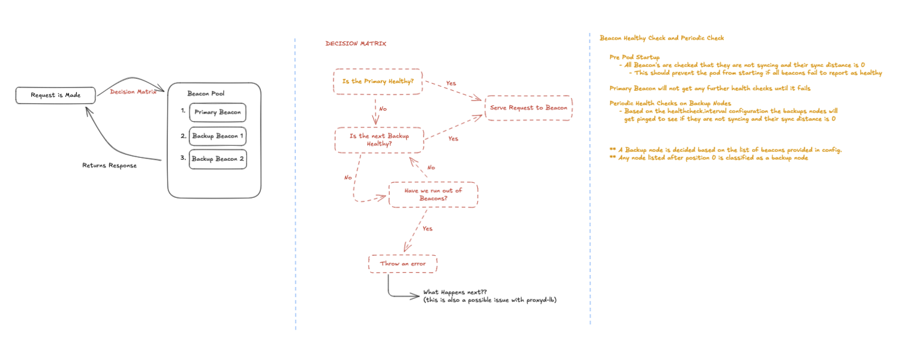

# Consensus Proxy

A high-performance Ethereum beacon node load balancer and proxy written in Go. Provides intelligent failover, health monitoring, and request routing across multiple beacon node endpoints.

## Features

- **Primary-Backup Load Balancing** - Priority-based node selection with automatic failover and failback
- **Endpoint Validation** - Whitelist-based validation against the Ethereum Beacon Chain API specification
- **Health Monitoring** - Periodic beacon node health checks via `/eth/v1/node/syncing` with configurable intervals and failback thresholds
- **WebSocket Proxy** - Bidirectional WebSocket proxying for `/eth/v1/events` with automatic URL scheme conversion
- **Prometheus Metrics** - Request duration, success/failure rates, failover events, health check status, and node gauges
- **Rate Limiting** - Per-IP sliding window rate limiter with automatic client cleanup
- **DNS Caching** - In-memory DNS cache with configurable TTL to reduce lookup overhead
- **Connection Pooling** - Configurable HTTP transport with per-host connection limits and keep-alive
- **Security Headers** - CORS, CSP, X-Frame-Options, and other security headers out of the box
- **Structured Logging** - JSON or text logging via Go's `slog` with configurable levels and output destinations

## Table of Contents

- [Quick Start](#quick-start)
- [Configuration](#configuration)
- [API Endpoints](#api-endpoints)
- [Architecture](#architecture)
- [Monitoring](#monitoring)
- [Development](#development)
- [Testing](#testing)
- [License](#license)

## Quick Start

### Prerequisites

- Go 1.25+
- Ethereum beacon nodes (Lighthouse, Prysm, Nimbus, Teku, Erigon, or hosted providers)

### Build and Run

```bash
git clone https://github.com/zircuit-labs/consensus-proxy.git
cd consensus-proxy

make build

# Edit config.toml with your beacon node endpoints (see config.toml.example for defaults)
./bin/consensus-proxy
```

The proxy listens on `http://localhost:8080` by default.

### Docker

```bash
make docker
make docker-run
```

### Command Line Options

```bash
./bin/consensus-proxy                          # Load config.toml from current directory
./bin/consensus-proxy --config /path/to/config.toml  # Custom config file
./bin/consensus-proxy --help                   # Show help

# Or use environment variable
CONSENSUS_PROXY_CONFIG="/path/to/config.toml" ./bin/consensus-proxy
```

## Configuration

The proxy is configured via a TOML file. See [`config.toml.example`](config.toml.example) for all options with defaults.

### Server

```toml
[server]
port = 8080
read_timeout = "30s"
write_timeout = "30s"
max_retries = 3                # Max failover attempts per request
request_timeout = "1200ms"     # Overall timeout for proxied requests
idle_timeout = "90s"
read_header_timeout = "10s"
```

### Beacon Nodes

The first node in the list is the primary. Remaining nodes are backups in priority order.

```toml
[beacons]
nodes = ["primary-node", "backup-node"]

[beacons.primary-node]
url = "http://beacon-1:5052"
type = "lighthouse"

[beacons.backup-node]
url = "http://beacon-2:5052"
type = "erigon"
```

Supported client types: `lighthouse`, `prysm`, `nimbus`, `teku`, `erigon`, and hosted providers.

### Failover and Health Checks

```toml
[failover]
error_threshold = 5              # Consecutive errors before demoting primary

[healthcheck]
interval = "30s"                 # How often to check backup node health
timeout = "5s"                   # Timeout per health check
successful_checks_for_failback = 3  # Consecutive successes before restoring original primary
```

### Metrics

```toml
[metrics]
enabled = true
namespace = "consensus_proxy"
```

### Rate Limiting

```toml
[ratelimit]
enabled = false
requests_per_second = 100
window = "1m"
cleanup_interval = "5m"
client_expiry = "10m"
```

### DNS and Proxy Tuning

```toml
[dns]
cache_ttl = "5m"
connection_timeout = "10s"

[proxy]
user_agent = "consensus-proxy/1.0"
max_idle_connections = 100
idle_connection_timeout = "90s"
max_idle_connections_per_host = 10
max_connections_per_host = 100
response_header_timeout = "10s"
tls_handshake_timeout = "10s"
expect_continue_timeout = "1s"
```

### WebSocket

```toml
[websocket]
read_buffer_size = 4096
write_buffer_size = 4096
error_channel_buffer = 100
```

### Logging

```toml
[logger]
level = "info"       # debug, info, warn, error
format = "json"      # json or text
output = "stdout"    # stdout, stderr, or file path
```

## API Endpoints

### Proxy Endpoints

All requests matching the [Ethereum Beacon Chain API](https://ethereum.github.io/beacon-APIs/) specification are proxied to healthy nodes. Validated endpoint categories:

| Category | Paths |
|----------|-------|
| Beacon | `/eth/v1/beacon/*`, `/eth/v2/beacon/*`, `/eth/v3/beacon/*` |
| Config | `/eth/v1/config/fork_schedule`, `/eth/v1/config/spec`, `/eth/v1/config/deposit_contract` |
| Debug | `/eth/v1/debug/*`, `/eth/v2/debug/*` |
| Events | `/eth/v1/events` (WebSocket) |
| Node | `/eth/v1/node/identity`, `/eth/v1/node/peers`, `/eth/v1/node/syncing`, `/eth/v1/node/health`, etc. |
| Validator | `/eth/v1/validator/*`, `/eth/v2/validator/*`, `/eth/v3/validator/*` |
| Builder | `/eth/v1/builder/states/*/expected_withdrawals` |
| Rewards | `/eth/v1/beacon/rewards/*` |

Requests to unrecognized endpoints receive `403 Forbidden`. The full list of validated patterns is in [`cmd/validator/validator.go`](cmd/validator/validator.go).

### Management Endpoints

| Endpoint | Description |
|----------|-------------|
| `GET /healthz` | Health check (always returns 200 OK) |
| `GET /metrics` | Prometheus metrics |

## Architecture

### Request Flow

1. Request arrives at the proxy
2. Rate limiter checks per-IP limits (if enabled)
3. CORS and security headers are applied
4. Endpoint is validated against Beacon Chain API spec
5. Request is forwarded to the highest-priority healthy node
6. On failure (5xx), retry with next healthy node (up to `max_retries`)
7. Response is returned to the client with metrics recorded

### Failover Strategy

- **Demotion**: After `error_threshold` consecutive server errors, the primary node is demoted to backup priority
- **Promotion**: The highest-priority healthy backup is promoted to primary
- **Failback**: After `successful_checks_for_failback` consecutive healthy checks, the original primary is restored to its original priority

### Health Checks

- **Startup**: All nodes are checked concurrently via `/eth/v1/node/syncing` before the proxy begins serving traffic. Nodes must report `is_syncing=false` and `sync_distance=0`
- **Periodic**: Backup nodes are checked on a configurable interval. The primary is validated on each request

### Project Structure

```
consensus-proxy/
├── main.go                          # Entry point, config loading, route setup
├── cmd/
│   ├── beaconnode/                  # BeaconNode struct, health checks, DNS cache, reverse proxy setup
│   ├── config/                      # TOML config parsing and validation
│   ├── handlers/                    # CORS/security headers, /healthz endpoint
│   ├── loadbalancer/                # Load balancer, HTTP/WebSocket handlers, retry logic, health management
│   ├── logger/                      # Structured logging with slog
│   ├── metrics/                     # Prometheus metrics client
│   ├── ratelimit/                   # Per-IP sliding window rate limiter
│   └── validator/                   # Beacon Chain API endpoint validation
├── tests/                           # Benchmarks and stress tests
├── config.toml                      # Default configuration
├── config.toml.example              # Example configuration with all defaults documented
├── Dockerfile                       # Multi-stage Docker build
└── Makefile                         # Build, test, and dev commands
```



## Monitoring

### Key Metrics

| Metric | Type | Description |
|--------|------|-------------|
| `request.duration` | Summary | Request latency by node and status (p50, p90, p99) |
| `request.success` | Counter | Successful requests |
| `request.failure` | Counter | Failed requests |
| `request.failover` | Counter | Failover events |
| `request.invalid_endpoint` | Counter | Rejected invalid endpoints |
| `healthcheck.success` | Counter | Successful health checks |
| `healthcheck.failed` | Counter | Failed health checks |
| `healthcheck.not_synced` | Counter | Nodes reporting as syncing |
| `node.primary_demoted` | Counter | Primary demotion events |
| `node.backup_promoted` | Counter | Backup promotion events |
| `node.failback_to_original_primary` | Counter | Failback events |
| `websocket.connected` | Counter | WebSocket connections opened |
| `websocket.disconnected` | Counter | WebSocket connections closed |
| `loadbalancer.healthy_backup_nodes` | Gauge | Current healthy backup node count |

All metrics are prefixed with the configured `namespace` (default: `consensus_proxy`).

### Logging

Structured logging includes:

- Request routing decisions and response times
- Node health status transitions
- Failover and failback events
- Startup configuration summary

## Development

### Make Commands

```bash
make build              # Build binary to bin/consensus-proxy
make install            # Download and tidy dependencies
make dev                # Run development server with config.toml
make test               # Run full test suite
make test-unit          # Run unit tests (cmd/ packages)
make test-integration   # Run integration tests (tests/ directory)
make benchmark          # Run benchmarks with mock servers
make benchmark-real     # Run benchmarks against real beacon nodes
make stress             # Run stress tests with mock servers
make stress-real        # Run stress tests against real beacon nodes
make docker             # Build Docker image
make docker-run         # Run Docker container with local config.toml
make clean              # Remove build artifacts and Docker image
make help               # Show all available commands
```

### Test Modes

By default, benchmarks and stress tests use mock HTTP servers for isolation. Set `CONSENSUS_PROXY_TEST_MODE=real` to test against actual beacon nodes configured in `config.toml`.

## Testing

### Test Categories

- **Unit Tests** (`cmd/`): Package-level tests for config parsing, health checks, load balancer logic, metrics, rate limiting, and endpoint validation
- **Integration Tests** (`tests/`): End-to-end request routing through the full proxy stack
- **Benchmarks** (`tests/`): Performance measurement with configurable concurrency
- **Stress Tests** (`tests/`): High-concurrency load testing at low, medium, and high levels

### Running Tests

```bash
make test                # All tests
make test-unit           # Unit tests only
make test-integration    # Integration tests only
make benchmark           # Benchmarks (mock)
make stress              # Stress tests (mock)

# Test against real nodes
make benchmark-real
make stress-real
```

## License

This project is licensed under the MIT License. See [LICENSE](LICENSE) for details.